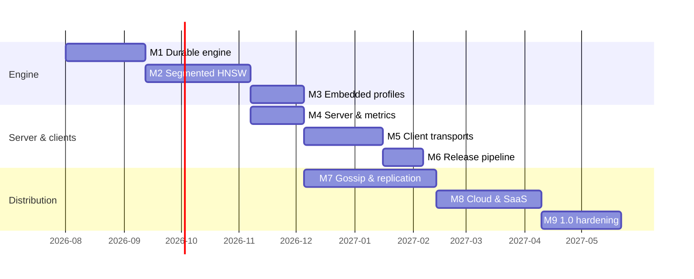

# Aster development plan

Roadmap for building Aster: a peer-to-peer, low-resource vector database in
C++20, built with Bazel, shipped as a server, an embedded library, and seven
client libraries from a single monorepo.

Companion documents:

- `design.md` — system architecture (LSM + segmented HNSW + Cassandra-style ring)
- `code-structure.md` — layered, portability-first code organization
- `client-api.md` — collection-centric public API
- `indexing.md` — indexing algorithm reference (normative for M2/M7)
- `tasks.md` — atomic claimable sub-tasks for every milestone
- `start-the-tasks.md` — how parallel agents claim lanes and ship without collisions
- `../tla/README.md` — formal specifications (normative for M1/M2/M7)

## Guiding rules

1. **Specify before building the hard parts.** The indexing lifecycle and
   replication protocol are model-checked in TLA+ *before* implementation
   (done: `tla/AsterLsmIndex.tla`, `tla/AsterReplication.tla`). Code changes
   that alter those semantics must update the spec first.
2. **Correctness baseline first, speed second.** Every ANN path is validated
   against the exact brute-force index; recall targets are tracked in CI.
3. **Single-node embedded quality before distribution.** The engine must be
   excellent as "SQLite for vectors" before gossip and replication layer on.
4. **The monorepo is the product.** Server, embedded library, and all client
   packages release together from one version tag, built by Bazel.

## Milestones

### M0 — Foundation (done)

Bazel 9 (bzlmod) workspace, C++20, layered source tree per
`code-structure.md`, CI-ready tests.

Delivered: `Status`/`Result` error model, core types with LWW ordering,
hashing, scalar distance kernels (L2/dot/cosine) with a uniform
higher-is-better score, exact per-segment index, WAL with CRC framing and
torn-tail recovery, LWW memtable, immutable segments, LWW compaction with
tombstone rules, consistent-hash ring with vnodes, top-k merge, a `Db`
facade wiring it together, demo CLI, Thrift IDL, client API stubs in seven
languages, TLA+ specs for the index lifecycle and replication.

### M1 — Durable single-node engine (~6 weeks)

Goal: crash-safe, disk-backed engine matching `tla/AsterLsmIndex.tla`.

- SSTable on-disk format (header, bloom filter, sparse index, ID index,
  vector block, metadata block, tag bitmap block, footer with CRC).
- Segment manifest with atomic swap; crash recovery = manifest + WAL replay.
- WAL group-commit (`EVERY_MS`) and WAL truncation after flush.
- Background flush and compaction threads; size-tiered compaction policy.
- Bloom filters and sparse index for ID lookup; binary ID representation.
- CBOR metadata encoding; LZ4/Zstd block compression behind a feature flag.
- Deletion correctness: tombstone GC only in full-overlap compactions
  (the `NoResurrection` invariant from the spec).
- Exit criteria: kill -9 fuzz test recovers with zero acked-write loss;
  100k upserts/sec sustained on a laptop with flush+compaction running.

### M2 — Segmented HNSW (~8 weeks)

Goal: real ANN per `indexing.md`, replacing the exact index for large
segments. This is the heart of the project.

- HNSW build (per immutable segment) and search; `M`, `ef_construction`,
  `ef_search`, `max_layers` exposed; per-query `ef_search`.
- Background index build state machine (segment searchable via brute force
  until its graph is `READY` — modeled in `tla/AsterLsmIndex.tla`).
- Graph merge strategy during compaction (rebuild first; incremental
  insert-into-largest as an optimization).
- Tag roaring bitmaps + post-filter with adaptive over-fetch.
- SIMD kernels: AVX2, AVX-512, NEON, runtime dispatch; alignment layout.
- Recall CI: nightly recall@10 against exact baseline on standard datasets
  (SIFT1M, GloVe); regression gate at target recall ≥ 0.95 @ ef=128.
- Exit criteria: 1M×384d search p50 < 5 ms single node; recall gate green.

### M3 — Embedded & platform profiles (~4 weeks)

Goal: "SQLite mode" is a first-class product.

- `aster::Db` stabilized as the embedded public API; amalgamated release.
- Platform abstraction backends: Posix (mmap), Memory; S3 backend skeleton.
- Tiny/Edge/Server compile-time profiles; ARM (NEON) CI build.
- Memory budget enforcement; arena allocators on the write path.
- Exit criteria: edge profile runs on Raspberry Pi in <128 MB with 1M
  vectors on SSD.

### M4 — Server & observability (~4 weeks)

Goal: a deployable single-node server.

- Thrift RPC server (framed TCP, optional TLS) implementing `aster.thrift`.
- Collection management (create/drop/configure) per `client-api.md`.
- TOML configuration; Prometheus `/metrics`; Grafana dashboard; Docker
  image (static binary, <15 MB).
- Exit criteria: server soak test 24h under mixed load, no leaks (ASan/TSan
  clean).

### M5 — Client libraries: transport + protocol (~6 weeks, parallelizable)

Goal: all seven clients speak to the server; generated code from the IDL.

- Bazel Thrift codegen wired for C++, Python, Go, Rust, Java, Scala, JS.
- Implement the facade contract in `clients/README.md`: pooling, retries,
  seed-node failover; async where native.
- Conformance suite: one language-agnostic YAML test corpus executed by
  every client against a server fixture (same corpus = no drift).
- Exit criteria: conformance suite green for all seven clients.

### M6 — Release engineering (~3 weeks)

Goal: `git tag vX.Y.Z` publishes everything.

- Add `rules_python`, `rules_go`, `rules_rust`, `rules_jvm_external`,
  `rules_scala`, `aspect_rules_js` to `MODULE.bazel`; replace filegroup
  placeholders with real build+package targets.
- CI release pipeline: PyPI, crates.io, Maven Central (java+scala), npm,
  Go module proxy tags, Docker Hub, GitHub release with embedded-library
  amalgamation.
- Versioning policy (single version across server + clients), signed
  artifacts, CHANGELOG automation.
- Exit criteria: dry-run publish of v0.1.0-rc to test registries.

### M7 — Distribution: gossip, replication, repair (~10 weeks)

Goal: the peer-to-peer cluster per `design.md`, matching
`tla/AsterReplication.tla`.

- Gossip membership + phi-accrual failure detection; vnode ownership from
  the ring (already implemented and tested).
- Coordinator write/read paths with ONE/QUORUM/ALL; LWW reconciliation;
  read repair; hinted handoff.
- Distributed search: scatter-gather across replica sets, per-replica
  top-k merge (the `MergeTopK` semantics), replica-aware retry on low
  recall.
- Anti-entropy repair (Merkle trees over segments).
- Jepsen-style fault-injection suite; every observed anomaly must be
  reproducible (or refuted) in the TLA+ model before the fix ships.
- Exit criteria: 5-node cluster survives node kill/partition/rejoin with
  eventual convergence verified; quorum read-your-writes holds under fault
  injection.

### M8 — Cloud & SaaS enablement (~8 weeks)

Goal: the economics layer from `client-api.md` and `saas-ideas.md`.

- S3 storage backend complete: multipart upload, range GET, local block
  cache, HNSW upper layers pinned locally; spot-instance-safe (all state
  recoverable from S3).
- HOT/WARM/COLD storage modes; accuracy profiles (COST_OPTIMIZED …
  MAX_RECALL); per-collection resource limits and isolation levels.
- Multi-tenancy: projects, API keys, per-collection quotas.
- Exit criteria: cold-start a node from S3 only; cost model benchmarked.

### M9 — 1.0 hardening (~6 weeks)

- Performance targets from `design.md` verified and published (100k
  writes/s/node, 1M-vector search 1–5 ms, ID lookup <1 ms).
- Security review (TLS, authn/z), fuzzing (WAL, SSTable, RPC decoders).
- Docs site, operations guide, upgrade/downgrade story.

## Timeline overview

M4/M5 overlap with M3/M7 given more than one contributor; the critical path
is M1 → M2 → M7 → M8.

## Risk register

| Risk | Impact | Mitigation |
| --- | --- | --- |
| HNSW recall degrades across many small segments | Search quality | Compaction keeps segment count bounded; recall CI gate; exact fallback for small segments |
| Tombstone/LWW subtleties cause resurrection bugs | Data loss semantics | Modeled in TLA+ (`NoResurrection`); property-based tests mirror the spec |
| Bazel rulesets for 7 languages churn | Release pipeline | Rulesets pinned via bzlmod; conformance suite decouples clients from server internals |
| S3 latency dominates cold search | SaaS viability | Local block cache + pinned upper graph layers; WARM mode default |
| Scope creep before single-node quality | Everything | Milestone gates; M7 does not start until M2 exit criteria hold |
