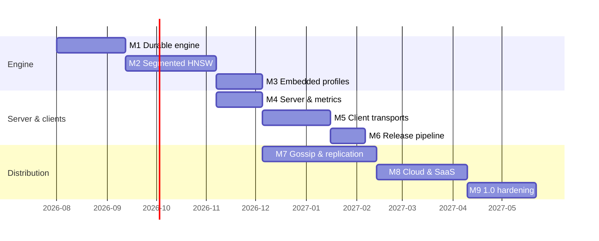

# Aster development plan

Roadmap for Aster: peer-to-peer, low-resource vector database in C++20
(Bazel), shipped as server, embedded library, and seven clients from one
monorepo.

Companion docs: [design](design.md), [code structure](code-structure.md),
[client API](client-api.md), [indexing](indexing.md), [tutorials](tutorials/README.md),
[tasks](tasks.md), [TLA+](../tla/README.md).

## Guiding rules

1. **Specify before building the hard parts.** Index lifecycle and
   replication are model-checked in TLA+ first
   (`tla/AsterLsmIndex.tla`, `tla/AsterReplication.tla`).
2. **Correctness baseline first.** Every ANN path is validated against the
   exact index; recall gates land with HNSW (M2).
3. **Single-node quality before distribution.** Excellent embedded/local
   engine before gossip and replication.
4. **The monorepo is the product.** One version tag for server + clients.

## Progress snapshot (2026-08)

| Area | State |
| --- | --- |
| M0 Foundation | **Done** |
| M1 Durable engine | **Partial** — SSTable, manifest, WAL open/replay, flush/compact, auto-compact; background threads / compression / CBOR still open |
| M2 Segmented HNSW | Not started (exact index only) |
| M3 Embedded & profiles | **Partial** — Tiny/Edge/Server, Arduino `embedded`, BusyBox musl image, memory sharing |
| M4 Server | **Partial** — multi-collection catalog + HTTP JSON API (`aster serve`), Prometheus `/metrics`; Thrift RPC still open |
| M5+ Clients / cluster | Not started (Thrift IDL + client facades/stubs only) |
| CI | GitHub Actions: `bazel test //aster/...` on `main` |
| Business-plan Phase 1 | **Kernel ready** — collections + CRUD/search HTTP + usage meters; HNSW/compression/SaaS control plane still open |

## Milestones

### M0 — Foundation (done)

Bazel 9 (bzlmod), C++20 tree, tests + CI.

Delivered: `Status`/`Result`, LWW types, hash, scalar distances, exact
index, WAL + CRC, memtable, segments, compaction rules, consistent-hash
ring, top-k merge, `Db` facade, demo CLI, Thrift IDL, seven client stubs,
TLA+ specs.

### M1 — Durable single-node engine (~6 weeks)

Goal: crash-safe disk engine matching `tla/AsterLsmIndex.tla`.

**Done so far:** SSTable format (header, bloom, sparse/ID index, vectors,
metadata, tags, footer), manifest atomic publish, `Db::Open` + WAL replay,
flush → SSTable + WAL truncate, full compact, shared segment/index memory,
auto-compact by segment count.

**Still open:**

- Background flush/compaction threads; size-tiered policy
- WAL group-commit (`EVERY_MS`) production tuning
- CBOR metadata encoding; LZ4/Zstd behind a feature flag
- Kill -9 fuzz exit criterion; sustained write benchmark targets

### M2 — Segmented HNSW (~8 weeks)

Goal: real ANN per [indexing.md](indexing.md).

- Per-segment HNSW build/search; params `M`, `ef_*`, `max_layers`
- Background build state machine (exact until `READY`)
- Graph merge on compact; tag bitmaps + over-fetch
- SIMD kernels; recall CI ≥ 0.95 @ ef=128

### M3 — Embedded & platform profiles (~4 weeks)

Goal: “SQLite for vectors” as a first-class product.

**Done so far:** compile-time profiles, Arduino/Tiny embedded lib, POSIX +
memory backends, BusyBox Docker (~few MB static), build matrix scripts,
write-path arena/slab + memory budget (M3-T07).

**Still open:** Pi soak exit criteria.
Installable `//aster:embedded_lib` target is done (M3-T02).

### M4 — Server & observability (~4 weeks)

Thrift RPC server, collection management, TOML config, Prometheus,
production Docker image. Exit: 24h soak, ASan/TSan clean.

### M5 — Client libraries: transport + protocol (~6 weeks)

Bazel Thrift codegen for all seven languages; pooling/retries/failover;
conformance suite. Facades already match [client-api.md](client-api.md) /
[tutorials/client-libraries.md](tutorials/client-libraries.md).

### M6 — Release engineering (~3 weeks)

Language rulesets in `MODULE.bazel`; publish PyPI / crates.io / Maven /
npm / Go tags / Docker Hub from `vX.Y.Z`. See [versioning.md](versioning.md).

### M7 — Distribution (~10 weeks)

Gossip, replication (ONE/QUORUM/ALL), read repair, hinted handoff,
scatter-gather search, anti-entropy — match `tla/AsterReplication.tla`.

### M8 — Cloud & SaaS (~8 weeks)

S3 backend, HOT/WARM/COLD, accuracy profiles, multi-tenancy / quotas.

### M9 — 1.0 hardening (~6 weeks)

Published perf targets, security review, fuzzing, docs site / ops guide.

## Timeline overview

Critical path: M1 → M2 → M7 → M8. M3/M4/M5 can overlap with more
contributors.

## Risk register

| Risk | Impact | Mitigation |
| --- | --- | --- |
| HNSW recall across many small segments | Search quality | Auto-compact bounds segments; recall CI; exact fallback for small segments |
| Tombstone / LWW resurrection | Semantics bugs | TLA+ `NoResurrection`; property tests |
| Seven-language Bazel churn | Releases | Pin rulesets; conformance suite |
| S3 latency on cold search | SaaS | Block cache + pinned upper layers; WARM default |
| Scope before single-node quality | Everything | Milestone gates; M7 waits on M2 exit criteria |
