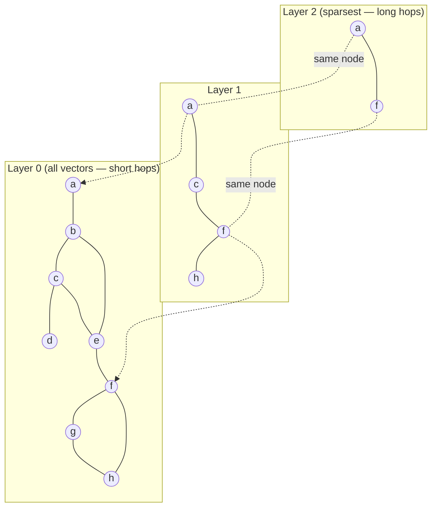
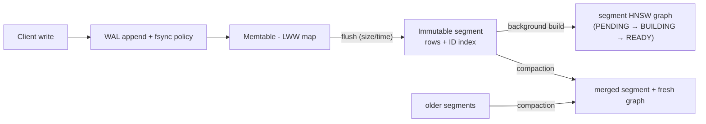
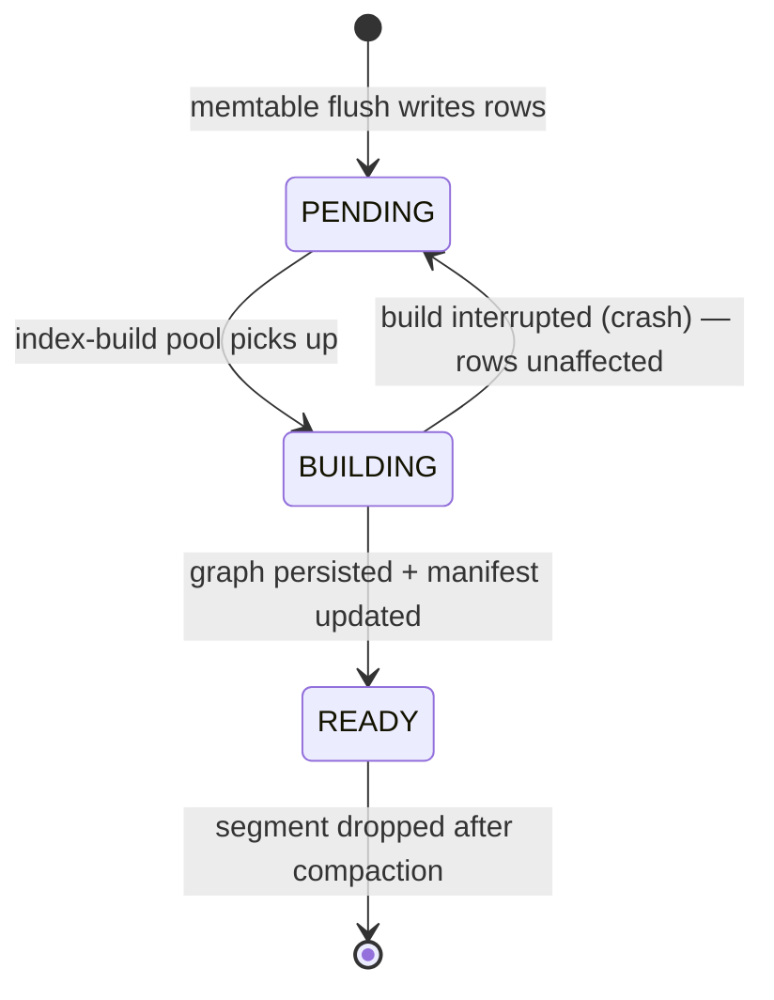
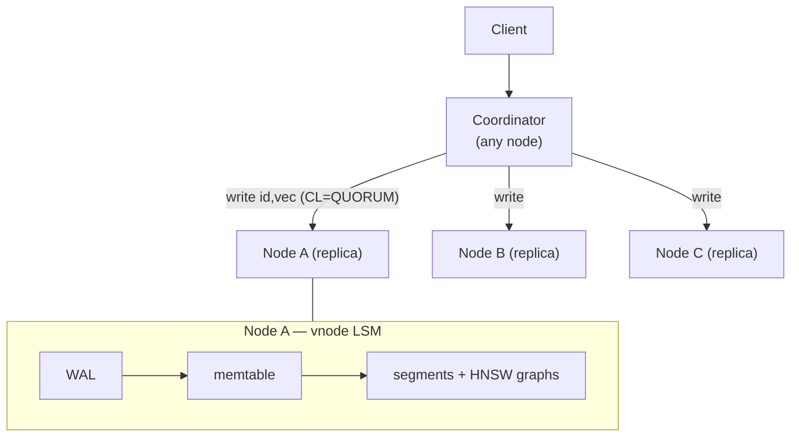
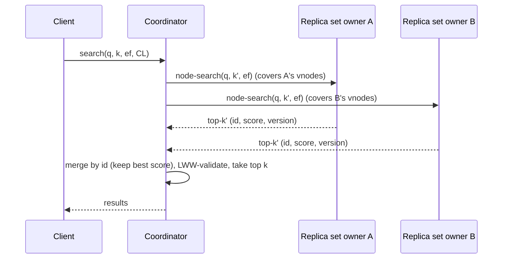

# Aster indexing reference

Normative reference for vector indexing: HNSW, immutable per-segment
graphs inside the LSM engine, and distributed search behavior.

**Implementation status:** search today uses the **exact** index
(`BuildExactIndex`). Segmented HNSW is milestone **M2**. Lifecycle
invariants are already specified in
[`tla/AsterLsmIndex.tla`](../tla/AsterLsmIndex.tla) and
[`tla/AsterReplication.tla`](../tla/AsterReplication.tla) — do not change
those semantics without updating the specs.

Contents:


1. [Background: the ANN problem](#1-background-the-ann-problem)
2. [HNSW: the algorithm](#2-hnsw-the-algorithm)
3. [Why not one big mutable graph](#3-why-not-one-big-mutable-graph)
4. [Segmented HNSW: indexing inside the LSM tree](#4-segmented-hnsw-indexing-inside-the-lsm-tree)
5. [Deletes, updates, and visibility rules](#5-deletes-updates-and-visibility-rules)
6. [Compaction and graph maintenance](#6-compaction-and-graph-maintenance)
7. [Filtered search](#7-filtered-search)
8. [Distributed indexing and search](#8-distributed-indexing-and-search)
9. [Correctness properties](#9-correctness-properties)
10. [Performance engineering](#10-performance-engineering)
11. [Parameter reference](#11-parameter-reference)
12. [References](#12-references)

---

## 1. Background: the ANN problem

Given a collection of vectors `V ⊂ R^d` and a query `q`, *k*-nearest-neighbor
search returns the `k` vectors minimizing a distance (L2) or maximizing a
similarity (dot product, cosine). Exact search is a linear scan: `O(N·d)`
per query. At 1M × 384-dim float32 that is ~1.5 GB of reads per query —
fine at small N (Aster's Tiny profile does exactly this), hopeless at scale.

**Approximate** nearest-neighbor (ANN) indexes trade a little recall for
orders of magnitude less work. Recall@k is the fraction of the true k
nearest neighbors that the index returns:

```
recall@k = |returned ∩ true_top_k| / k
```

Aster uses HNSW graphs as its ANN index and always measures them against
the exact scan (`BuildExactIndex` in `aster/index/vector_index.h`).

Uniform scoring rule: Aster converts every metric to a "higher is better"
score (`Score()` in `aster/index/distance.h`), i.e. `-L2²`, `dot`, or
`cosine`. This means merge logic across segments and replicas never
branches on metric direction. It matters because merging happens in three
places (segment → node → coordinator) and a single inverted comparison
would silently return the *worst* neighbors.

## 2. HNSW: the algorithm

Hierarchical Navigable Small World graphs (Malkov & Yashunin, 2016) are a
multi-layer proximity graph:

- **Layer 0** contains *every* vector, each linked to up to `M0 = 2·M`
  near neighbors.
- **Layers 1..L** are progressively sparser "express lanes": each node is
  present in layer `l` with probability decaying exponentially; a node's
  top layer is drawn as `l = ⌊-ln(U(0,1)) · mL⌋` with `mL = 1/ln(M)`.
  Nodes on layers ≥ 1 keep up to `M` links.



Search descends the hierarchy: coarse hops at the top get you to the right
region in `O(log N)` steps; the wide beam search at layer 0 refines the
result.

### 2.1 Search

```text
SEARCH(q, k, ef_search):
  ep ← entry point (a node on the top layer)
  for layer ← top .. 1:                 # greedy descent, beam width 1
      ep ← SEARCH-LAYER(q, {ep}, ef=1, layer).best
  W ← SEARCH-LAYER(q, {ep}, ef=ef_search, layer=0)   # beam search
  return top k of W by score

SEARCH-LAYER(q, entry_points, ef, layer):
  visited ← entry_points
  candidates ← min-heap by distance(q,·) over entry_points
  W ← max-heap of size ef (current best ef results)
  while candidates not empty:
      c ← nearest candidate
      if distance(q,c) > distance(q, furthest in W): break   # beam converged
      for e in neighbors(c) at layer:
          if e not visited:
              visited ← visited ∪ {e}
              if distance(q,e) < distance(q, furthest in W) or |W| < ef:
                  add e to candidates and W (evict furthest if |W| > ef)
  return W
```

Properties that matter for Aster:

- `ef_search ≥ k` is required; larger `ef_search` monotonically improves
  expected recall at linear extra cost. This is the per-query knob exposed
  end-to-end (client → coordinator → segment search).
- Search touches `O(ef_search · M)` vectors — for 1M×384d with
  `ef=128, M=16` that is a few thousand distance computations instead of a
  million.
- Search is read-only: on an immutable graph it needs no locks at all,
  only a per-query `visited` set.

### 2.2 Insert (used at segment build time)

```text
INSERT(x, M, ef_construction):
  l_x ← ⌊-ln(U(0,1)) · (1/ln M)⌋                 # top layer for x
  ep ← global entry point
  for layer ← top .. l_x+1:
      ep ← SEARCH-LAYER(x, {ep}, ef=1, layer).best
  for layer ← min(top, l_x) .. 0:
      W ← SEARCH-LAYER(x, {ep}, ef_construction, layer)
      neighbors ← SELECT-NEIGHBORS-HEURISTIC(x, W, M or M0)
      connect x ↔ neighbors at this layer
      for n in neighbors:                        # keep degrees bounded
          if degree(n) > limit: n.links ← SELECT-NEIGHBORS-HEURISTIC(n, n.links, limit)
      ep ← W.best
  if l_x > top: entry point ← x
```

`SELECT-NEIGHBORS-HEURISTIC` is the diversity heuristic from the paper: a
candidate is kept only if it is closer to `x` than to every neighbor
already kept. This prevents all links pointing into one dense cluster and
is what preserves graph navigability — a plain "M closest" selection
measurably hurts recall on clustered data.

Build cost is `O(N · log N · ef_construction · d)` in practice; building is
the expensive part of HNSW, which is precisely why Aster never rebuilds
graphs on the write path (section 4).

## 3. Why not one big mutable graph

The classic deployment (one global, mutable HNSW protected by locks) fails
Aster's requirements:

| Problem | Cause |
| --- | --- |
| Write stalls | Insert takes `ef_construction`-wide searches + link updates; under `M`-sized lock scopes, writers contend with every reader |
| Graph degradation | Deletes leave "holes": HNSW has no cheap delete. Marking nodes deleted skews traversal; physically unlinking breaks connectivity. Long update-heavy workloads measurably lose recall (see FreshDiskANN, SPFresh) |
| No crash story | A half-updated graph is not recoverable; you need either full WAL of graph edits or a rebuild |
| Poor tiering | One giant graph cannot be partially on SSD/S3; segments can |

The industry converged on the same answer Aster uses: **immutable
per-segment graphs managed like SSTables**. Lucene (and therefore
Elasticsearch/OpenSearch) builds one HNSW graph per immutable segment and
merges them during segment merges; FreshDiskANN serves fresh writes from a
small in-memory index and periodically consolidates them into the
SSD-resident long-term index (out-of-place updates + background merge).
Aster adopts this family of designs as its core: immutable graphs,
freshness from a separate write path, quality restored by background
merges.

## 4. Segmented HNSW: indexing inside the LSM tree

### 4.1 Data flow



Rules:

1. **A write is acknowledged after WAL + memtable**, never waiting for any
   graph work. Index construction is asynchronous and off the write path.
2. **A flushed segment is immediately searchable** — before its HNSW graph
   exists — via exact scan of its vector block. Small segments are cheap to
   scan; this removes any visibility gap. When the graph reaches `READY`,
   search atomically switches to it. (This is the `SegState` machine in the
   TLA+ spec; the invariant `SearchCompleteness` holds in every state.)
3. **Segments are immutable.** No graph is ever mutated after build. All
   "mutation" is expressed as new rows (upserts/tombstones) in newer
   segments, reconciled at read time by LWW.

### 4.2 Search across segments

A single-node query fans out to the memtable and all live segments and
merges:

```text
NODE-SEARCH(q, k, ef, tags):
  C ← []
  C += scan(memtable live rows)               # exact, tiny
  for s in segments:                          # parallel
      C += s.READY ? s.hnsw.search(q, fetch_k, ef)
                   : s.exact_scan(q, fetch_k)  # fetch_k = 2k + c (over-fetch)
  merged ← merge_by_id_keep_best(C)           # dedupe: newest may shadow
  results ← []
  for hit in merged by score desc:
      row ← reconcile(hit.id)                 # LWW across memtable+segments
      if row.tombstone: continue              # deleted since indexed
      if not tags ⊆ row.tags: continue        # post-filter (section 7)
      results += (hit.id, score(q, row.vector))   # exact rerank on latest vector
      if |results| = k: break
  return results
```

Two subtleties, both bugs-in-waiting if skipped:

- **Reconcile before returning.** A segment graph may return a row that a
  newer segment has deleted or moved. The hit must be validated against the
  LWW-reconciled row, and the score recomputed from the *latest* vector
  (the segment's copy may be stale). `aster/db/db.cc` implements exactly
  this; `db_test.cc` (`DeleteHidesRowEvenIfIndexedInSegment`,
  `UpdateInMemtableShadowsSegmentVersion`) pins it.
- **Over-fetch.** Because reconciliation and tag filtering discard
  candidates, each segment is queried for `fetch_k > k` results. Aster uses
  `2k + 16` as the default and adapts upward when filters are selective
  (section 7).

Cost model: with `S` segments the query does `S` graph searches of
`O(ef · M · d)` each. Recall across the union of segments is at least the
per-segment recall (searching more, smaller graphs with the same `ef` finds
*more* candidates, not fewer, at higher CPU cost). The trade-off is purely
CPU: keeping `S` bounded is compaction's job.

### 4.3 Segment index build state machine



The graph file is derived data: it can always be rebuilt from the segment's
vector block. A crash during build loses only CPU work. The manifest never
points to a partially written graph (write-temp-then-atomic-swap).

## 5. Deletes, updates, and visibility rules

HNSW cannot delete; Aster never asks it to. Deletion is a data-plane
concept:

- `DELETE id` writes a **tombstone row** (WAL → memtable → segment) with a
  timestamp, exactly like an upsert.
- An **update** is just an upsert with a newer `(timestamp, version)`; the
  old vector remains in the old segment's graph until compaction.
- **Visibility** = LWW reconciliation at read time. For any id, the newest
  version across memtable + segments wins; if that version is a tombstone,
  the id is invisible everywhere (point reads *and* vector search).

Space amplification from shadowed vectors is bounded by compaction (a
shadowed or deleted vector still occupies graph nodes and gets visited by
searches until its segment is compacted away). The metric
`segment_shadowed_fraction` drives compaction prioritization: a segment
where >30% of rows are shadowed/tombstoned is compacted preferentially,
because it wastes both memory and `ef` budget.

**Tombstone GC rule** (the classic LSM resurrection trap): a tombstone may
only be dropped by a compaction whose input set covers *every* segment that
could contain an older version of the key. Aster restricts tombstone purge
to full-overlap compactions per vnode. Model-checked as `NoResurrection`
in `tla/AsterLsmIndex.tla`; unit-pinned in `storage_test.cc`.

## 6. Compaction and graph maintenance

Compaction serves three masters at once:

1. **Read amplification** — fewer segments = fewer graph searches/query.
2. **Space** — purge shadowed versions and tombstones.
3. **Graph quality** — a freshly built graph over the merged rows has none
   of the accumulated staleness; this is Aster's substitute for the online
   "repair" that mutable-graph systems need.

### 6.1 Policy

Size-tiered (Cassandra-style), per vnode:

```
L0: flush-sized segments   (≈ memtable size)
L1: ~4× L0
L2: ~4× L1 ...
trigger: ≥ T segments in a tier (default T=4), or shadowed_fraction > 0.3
```

### 6.2 Graph merge strategies

When compaction merges segments it must produce one graph over the merged
live rows. Strategies, in order of implementation:

| Strategy | How | When |
| --- | --- | --- |
| **Rebuild** (M2 default) | Build a fresh graph from scratch over merged rows | Always correct; cost `O(N log N)`; done off the hot path, so throughput not latency |
| **Insert-into-largest** | Reuse the largest input graph; insert the other inputs' live rows into it (standard HNSW inserts on the *private, not-yet-published* copy) | When one input dominates (e.g. L2 + small L0s). Lucene uses this trick for segment merges. Caveat: the reused graph keeps deleted nodes as traversal ghosts until the next rebuild, so track a staleness debt counter and force rebuild when it exceeds a threshold |
| **Connectivity-aware relayout** | During rebuild, order nodes by graph traversal locality (BFS from entry point) so adjacent nodes share pages | HDD/S3 tiers; turns random I/O into ~sequential (section 10.3) |

Compaction is atomic from the searcher's view: the new segment (rows +
graph) is fully built and persisted, then the manifest swaps the input
segments for the output in one step. Readers use whichever manifest
generation they started with (segments are refcounted; dropped when the
last reader releases). There is never a moment where a row is searchable
in zero segments — `SearchCompleteness` again.

### 6.3 The near-real-time trade

Freshly written rows are served from the memtable by exact scan, so Aster
is "real-time" in the sense that a write is searchable immediately after
ack. The engineering trade is memtable size: bigger memtables amortize
flushes but make the exact scan portion of every query larger. Defaults
target the memtable at ≲1–2% of collection size, where the scan cost is
noise. (The optional mutable "micrograph" over the memtable from
`design.md` is a future optimization with the same visibility semantics —
worth it only when memtables are large.)

## 7. Filtered search

Queries may carry tag predicates (`tags ⊆ row.tags`). Aster uses
**post-filtering with adaptive over-fetch**, plus per-segment tag bitmaps:

```text
selectivity σ ← estimate from segment tag bitmaps (roaring)
fetch_k ← clamp(k / max(σ, σ_min), 2k+16, ef_search)
hits ← hnsw.search(q, fetch_k, ef) filtered by bitmap membership check
if |filtered hits| < k:               # filter too selective for ANN
    fall back to bitmap-driven exact scan of matching rows
```

Rationale:

- For mild filters (σ ≳ 10%), post-filtering with over-fetch preserves
  recall at modest cost.
- For harsh filters (σ ≪ 1%), *no* amount of over-fetch is reliable — the
  graph may route entirely through non-matching regions. But a harsh filter
  means few matching rows, so the exact scan over the bitmap's rows is
  cheap. The crossover is decided per segment from the bitmap cardinality —
  this is the same strategy Qdrant and Weaviate document for filtered HNSW.
- Bitmap membership is checked *during* traversal result collection (not
  after), so non-matching hits don't consume `fetch_k` slots.

Filter-aware graph construction (extra links within frequent tag
subgraphs, as in filtered-DiskANN) is a possible M8+ enhancement and out of
scope here.

## 8. Distributed indexing and search

Everything above is per node — in fact per **vnode**: each vnode's data is
an independent LSM tree with independent segments and graphs. This is what
makes distribution composable: the ring moves *vnodes*, never graph
internals.

### 8.1 Placement and replication

- Row placement: `token = hash(id)`; the ring maps the token to `RF`
  distinct physical nodes (clockwise walk over vnode tokens —
  `aster/distributed/ring.cc`).
- Each replica independently runs the full write path (WAL → memtable →
  segment → graph). **Graphs are never shipped between nodes**; only rows
  are replicated. Replicas may flush/compact at different times, so their
  segment layouts diverge — but their *row sets* converge (LWW), and
  therefore their search results converge. This is the key invariant
  separating data replication from index replication, and it is what
  `tla/AsterReplication.tla` checks (`ConvergedReplicasAgree`).



### 8.2 Write path (consistency levels)

```
coordinator:
  ts ← hybrid timestamp                # LWW tiebreaker, node id breaks ties
  send (row, ts) to all RF replicas
  ack client after CL acks             # ONE / QUORUM / ALL
replica:
  WAL append → memtable apply (LWW) → ack
  (flush / graph build / compaction: local, asynchronous, per-replica)
```

Indexing lag is therefore **per replica and invisible to durability**: CL
governs how many replicas have the row durable, not how many have it in a
graph — the row is searchable on each replica the moment it is applied
(memtable scan), so there is no "index consistency level".

Failure handling: hinted handoff (coordinator stores a hint for a dead
replica, replays on recovery) plus anti-entropy repair (Merkle trees over
segment row sets) drive convergence. Both are row-level mechanisms; graphs
follow automatically because they are derived data.

### 8.3 Distributed search (scatter-gather)



- The coordinator picks, for each token range, **one** replica (the
  fastest/healthiest by gossip load stats) — a search does not need CL>ONE
  because ANN results are approximate anyway; CL=QUORUM search instead
  queries multiple replicas per range and unions candidates, buying both
  freshness and effective recall at ~RF× cost.
- Every node returns scores in the uniform higher-is-better form, so the
  coordinator merge is a plain top-k (`aster/query/topk.cc`).
- `k' = k` per node is sufficient for correctness of the union (each true
  neighbor lives in exactly one token range's replica set); over-fetch is
  still applied *inside* nodes for filter/LWW headroom.
- **Replica-aware recall retry** (`design.md` idea 5): if the merged result
  set's scores look degenerate (e.g. fewer than k hits after filtering),
  the coordinator retries the affected ranges on another replica or with a
  higher `ef` — possible only because `ef_search` is a per-request knob all
  the way down.

### 8.4 Consistency semantics for search

Aster is BASE: search reflects *some* recent state of each token range.
Guarantees, as model-checked:

- **Read-your-writes** holds when `W + R > RF` (e.g. QUORUM/QUORUM) for
  point reads, and for search when search CL is QUORUM (the union over a
  quorum of each range must include any quorum-acked write — checked as
  `QuorumSearchSeesAckedWrites`).
- With CL=ONE everywhere, an acked write may be missing from a search until
  replication/repair delivers it to the queried replica — bounded staleness
  in practice, eventual by the model (`EventualSearchVisibility` under the
  fairness assumptions).
- **Deletes**: tombstones replicate as ordinary rows and win by LWW, so
  each individual replica hides the row monotonically, and a QUORUM search
  never returns a quorum-acked-deleted row (`NoResurrectionQuorum`). At
  CL=ONE, a replica that has not yet received the tombstone can still
  return the old row — that is the BASE staleness window, closed by
  replication/repair, not a resurrection.

### 8.5 Topology changes

Node join/leave moves whole token ranges: the receiving node streams the
range's *rows* (segment row sets, not graphs) and builds segments + graphs
locally, exactly like bootstrap-from-WAL. Searches keep routing to the old
owner until the new owner's range is streamed and announced via gossip —
ownership handoff is atomic per range, so the scatter always covers every
range exactly once (`RingCoverage` invariant).

## 9. Correctness properties

Summary of what "correct indexing" means in Aster. Single-node properties
are checked by `tla/AsterLsmIndex.tla`, distributed ones by
`tla/AsterReplication.tla`; all are also pinned by unit/property tests.

| # | Property | Statement |
| --- | --- | --- |
| P1 | Durability | Every acknowledged write survives crash (WAL replay ∪ segments reconstruct exactly the acked LWW state) |
| P2 | Search completeness | Every acked, live (non-deleted) row is a candidate of node-search at all times — through flush, build, and compaction, in every intermediate state |
| P3 | No resurrection | Once a delete is acked, the row never reappears (single-node: tombstone GC rule; distributed: tombstones replicate and win LWW) |
| P4 | LWW convergence | Replicas that have received the same set of writes expose the same row versions, regardless of flush/compaction timing |
| P5 | Quorum visibility | `W+R>RF` ⇒ reads (and quorum searches) observe every acked write |
| P6 | Ring coverage | Scatter-gather queries each token range exactly once under any stable ownership map |
| P7 | Recall floor (statistical, not model-checked) | recall@10 ≥ target on reference datasets at default `ef`; enforced by CI, since P1–P6 say nothing about *approximation* quality |

Note the division of labor: TLA+ verifies the *lifecycle and distributed
protocol* (where the subtle bugs are — races between flush, compaction,
crash, replication). It cannot verify recall, which is a statistical
property of the graph — that is what the exact-baseline CI gate is for.

## 10. Performance engineering

### 10.1 Distance kernels

All hot loops reduce to L2²/dot over contiguous float32. Per
`design.md`: AVX2/AVX-512/NEON kernels behind runtime dispatch, 32-byte
aligned vector blocks, scalar fallback everywhere (the current
implementation). float16 and int8 (scalar-quantized) storage halve/quarter
memory bandwidth at small recall cost — applied per collection via
`VectorEncoding`, with reranking on float32 for int8.

### 10.2 Memory layout

Per segment (hot → cold): entry point + upper layers (tiny, always RAM);
layer-0 adjacency (the bulk of the graph: `N · M0 · 4` bytes with delta +
varint encoding); vector block (mmap; the OS page cache is the cache);
metadata (cold, never touched by traversal).

Rule of thumb at `M=16` (`M0=32`): graph ≈ 128 B/vector + vectors
themselves (1536 B at 384d float32) — the graph is <10% overhead, so
memory planning is dominated by vectors and controlled by encoding.

### 10.3 Disk/S3 tiers

HNSW traversal is random access; naive mmap on HDD/S3 collapses. Aster's
mitigations, in order of leverage: (1) connectivity-aware node ordering at
compaction — neighbors share pages, cutting page faults per hop;
(2) upper layers + entry points always pinned in RAM; (3) S3: 16–128 MB
immutable segment objects, range-GET for adjacency pages, local block
cache (the same design DiskANN validated for SSD-resident graphs).

### 10.4 Concurrency

Immutability does the heavy lifting: search takes no locks (refcounted
manifest snapshot); graph build touches only a private segment; compaction
publishes via atomic manifest swap. The only synchronized structure on the
query path is the memtable (single-writer, RCU-style snapshot reads in M1).

### 10.5 Tuning cheat sheet

| Goal | Turn |
| --- | --- |
| Higher recall, same index | `ef_search` ↑ (per query — no rebuild) |
| Higher recall ceiling | `M` ↑, `ef_construction` ↑ (rebuild; +memory, +build time) |
| Lower memory | int8/float16 encoding; `M` ↓; COLD storage mode |
| Faster writes | bigger memtable, async indexing (default), LZ4 instead of Zstd |
| Fewer per-query graph searches | more aggressive compaction (T ↓) |
| Cheap harsh-filter queries | rely on bitmap fallback — do not raise `ef` |

## 11. Parameter reference

| Parameter | Default | Range | Meaning |
| --- | --- | --- | --- |
| `m` | 16 | 4–64 | Max links/node, layers ≥ 1 (layer 0 uses 2M). Memory & recall ceiling |
| `ef_construction` | 128 | 32–1024 | Beam width at build. Quality of the graph |
| `ef_search_default` | 64 | ≥ k | Beam width at query; per-request override |
| `max_layers` | 16 | — | Hierarchy cap; `mL = 1/ln(M)` governs actual height |
| `max_elements_per_segment` | 1M | — | Segment split threshold at compaction |
| `memtable_flush_bytes` | 64 MB | — | Freshness-scan vs flush-rate trade |
| `compaction_tier_threshold` | 4 | 2–8 | Segments per tier before merge |
| `shadowed_compact_threshold` | 0.3 | — | Shadow/tombstone fraction forcing compaction |
| `fetch_k` policy | `2k+16` | — | Per-segment over-fetch, adaptive with filters |

Accuracy profiles (`client-api.md`) map onto these: COST_OPTIMIZED
(M=8, efc=50, efs=32) … MAX_RECALL (M=48, efc=500, efs=768).

## 12. References

1. Yu. A. Malkov, D. A. Yashunin. *Efficient and robust approximate nearest
   neighbor search using Hierarchical Navigable Small World graphs.*
   IEEE TPAMI 42(4), 2020 (arXiv:1603.09320). — HNSW algorithm, insert
   heuristic, `mL = 1/ln(M)` layer assignment.
2. S. Jayaram Subramanya et al. *DiskANN: Fast Accurate Billion-point
   Nearest Neighbor Search on a Single Node.* NeurIPS 2019. — SSD-resident
   graph layout, RAM-pinned navigation structure.
3. A. Singh et al. *FreshDiskANN: A Fast and Accurate Graph-Based ANN Index
   for Streaming Similarity Search.* arXiv:2105.09613, 2021. — degradation
   of graph indexes under deletes/updates; out-of-place update + background
   consolidation.
4. Y. Xu et al. *SPFresh: Incremental In-Place Update for Billion-Scale
   Vector Search.* SOSP 2023. — the contrasting approach: partition-based
   incremental in-place rebalancing (LIRE) instead of global rebuilds;
   documents why naive updates degrade index quality.
5. Apache Lucene HNSW implementation (`org.apache.lucene.util.hnsw`,
   Lucene 9+). — per-immutable-segment HNSW graphs, graph merge on segment
   merge; the production precedent for Aster's segmented design.
6. A. Lakshman, P. Malik. *Cassandra — A Decentralized Structured Storage
   System.* ACM SIGOPS OSR 44(2), 2010. — ring, vnodes, LWW, hinted
   handoff, anti-entropy repair.
7. P. O'Neil et al. *The Log-Structured Merge-Tree (LSM-Tree).* Acta
   Informatica 33, 1996. — memtable/segment/compaction lifecycle.
8. Qdrant & Weaviate documentation on filtered vector search. — the
   post-filter vs. filtered-scan crossover strategy in section 7.
