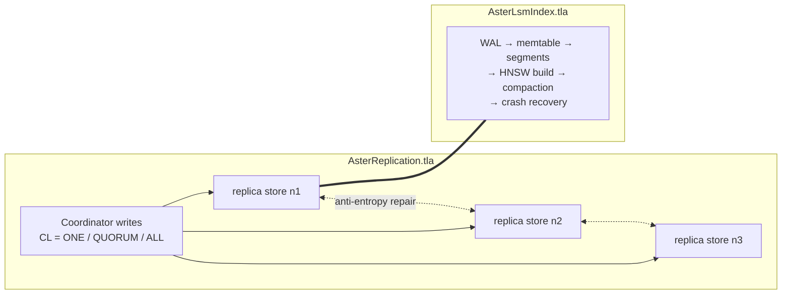

# Aster TLA+ specifications

Formal specifications of the parts of Aster where subtle bugs live: the
indexing lifecycle (flush, asynchronous HNSW build, compaction, crash
recovery) and the distributed replication protocol. Written and
model-checked **before** implementation; they are normative — code that
changes these semantics must change the spec first, and the change must
still pass TLC.

The prose companion is [`docs/indexing.md`](../docs/indexing.md); its
section 9 maps properties P1–P6 to the definitions here.

## Status (M7-T00)

**Done.** After M2-T04 wired `PENDING → BUILDING → READY` (plus
`AbortIndexBuild`), both specs still cover those semantics; TLC is green
with the bundled bounds. No new *replication* actions were required —
SegState stays inside `AsterLsmIndex`. The only model extension was
`AbortBuild` (bounded by `MaxAborts`) so mid-build abandon is an explicit
action, not only implied by crash recovery.

M7 protocol work (gossip, coordinator CL paths, repair) must extend
`AsterReplication` (and re-run TLC) *before* coding those bits.

## The two specs and how they compose



- **`AsterLsmIndex.tla`** — one node. Proves that *what search observes*
  (LWW-newest row across memtable + all segments, in every index build
  state) always equals *what was acknowledged*, through flush, partial and
  full compaction, WAL truncation, and crash recovery.
- **`AsterReplication.tla`** — one replica set. Abstracts each node's
  engine to its LWW row store — which is exactly the abstraction the first
  spec justifies — and proves consistency-level guarantees and convergence
  over asynchronous, lossy replication.

This layering is deliberate: composing "per-node search ≡ per-node store"
(spec 1) with "stores converge / quorums intersect" (spec 2) yields the
end-to-end claims about distributed search in `docs/indexing.md` §8.4.

### Modeling notes (what is abstracted and why it is sound)

| Real system | Model | Why sound |
| --- | --- | --- |
| Vector payloads | Row version = unique write timestamp | Lifecycle correctness is independent of vector contents; recall is a statistical property checked by CI, not TLC (P7) |
| HNSW graph per segment | Build state machine `PENDING → BUILDING → READY` (+ `AbortBuild`) | Rows are searchable by exact scan before `READY`; invariants quantify over *all* states, so "graph not built yet" can never hide a row |
| Crash + WAL replay + restart | One atomic `CrashRecover` step | A recovering node serves no reads, so intermediate recovery states are externally unobservable |
| Merkle-tree repair | Per-key `Repair` action adopting the LWW max | Any correct anti-entropy converges replica pairs to LWW max per key; the mechanism is irrelevant to the protocol guarantees |
| Ring / vnodes | Single replica set (RF = N) | Placement and coverage are deterministic functions tested in `aster/distributed/ring_test.cc`; the replication protocol is identical inside every range |

### M2-T04 ↔ AsterLsmIndex action map

| Code (`SegState` / Db) | TLA+ action | Notes |
| --- | --- | --- |
| Flush / compaction result starts `PENDING` | `Flush`, `CompactPartial`, `CompactFull` | Exact search from birth |
| `TryBeginIndexBuild` | `StartBuild` | `PENDING → BUILDING` |
| `CompleteIndexBuild` | `FinishBuild` | `BUILDING → READY` (graph optional on Tiny) |
| `AbortIndexBuild` | `AbortBuild` | `BUILDING → PENDING`; bounded by `MaxAborts` |
| Open: missing `.hnsw` / crash mid-build | `CrashRecover` | In-flight `BUILDING` resets to `PENDING` |
| `Search` exact until READY, then HNSW | `CandidateRows` / `SearchCompleteness` | Observation ignores SegState |

`AsterReplication` needs no SegState actions: graphs are not replicated;
quorum search merges LWW row stores that AsterLsmIndex already equates to
search under every SegState.

## Checked properties

| Property | Spec | Meaning (docs/indexing.md §9) |
| --- | --- | --- |
| `SearchCompleteness` | LsmIndex | P2: search sees exactly the acked state at all times |
| `NoResurrection` | LsmIndex | P3: an acked delete never becomes visible again |
| `WalTruncationSafe` | LsmIndex | P1: WAL + segments alone reconstruct the acked state (crash-safe) |
| `EventuallyAllIndexed` | LsmIndex | liveness: every segment's graph build completes |
| `QuorumReadConsistent` | Replication | P5: `W+R > N` ⇒ quorum reads/searches return the latest acked write |
| `NoResurrectionQuorum` | Replication | P3 distributed: quorum-acked deletes are invisible to quorum searches |
| `AckedWriteSomewhere` | Replication | P1 distributed: acked writes survive message loss |
| `EventualConsistency` | Replication | P4: replicas converge (⇒ searches converge) |

### Try breaking it

`AsterLsmIndex.tla` ships a deliberately buggy action,
`CompactPartialDropTombstones` (purging tombstones in a compaction that
does not cover all segments). Add it to `Next` and TLC produces the
classic LSM resurrection counterexample in seconds:

```
upsert k (ts1) → flush            \* segment 1 holds live k@1
delete k (ts2) → flush            \* segment 2 holds tombstone k@2
partial-compact segments {2,3}    \* tombstone purged "for space"
search k → returns k@1            \* NoResurrection violated
```

This is why `CompactSegments(..., drop_tombstones)` in
`aster/storage/segment.h` only allows purging in full compactions.

## Running the model checker

Requires Java 11+ (`tla2tools.jar` is downloaded on first run):

```bash
cd tla
curl -LO https://github.com/tlaplus/tlaplus/releases/latest/download/tla2tools.jar
java -XX:+UseParallelGC -jar tla2tools.jar -workers auto AsterLsmIndex.tla
java -XX:+UseParallelGC -jar tla2tools.jar -workers auto AsterReplication.tla
```

Both models check safety **and** liveness and finish in well under a
minute with the bundled `.cfg` bounds (2 keys / 4 writes / 3 segments /
2 crashes / 2 aborts, and 3 nodes / 3 writes respectively). The bounds are
small but sufficient: every interesting interleaving class (write vs. flush
vs. build vs. abort vs. compaction vs. crash; stale delivery vs. loss vs.
repair vs. quorum choice) occurs within them. Increase constants in the
`.cfg` files for more confidence; state count grows roughly exponentially
in `MaxWrites`.

## Keeping specs and code in sync

- `aster/storage/storage_test.cc` and `aster/db/db_test.cc` pin the same
  scenarios the specs check (LWW merge, tombstone purge rules, delete
  visibility through segment indexes, SegState PENDING→READY).
- Milestone M7 adds a Jepsen-style fault-injection suite; any anomaly it
  finds must be reproduced (or refuted) in these models before the fix
  ships (see `docs/development-plan.md`).
- CI runs both TLC checks on every change under `tla/` (and on changes to
  `aster/storage`, `aster/db`, or replication code once M7 lands).
